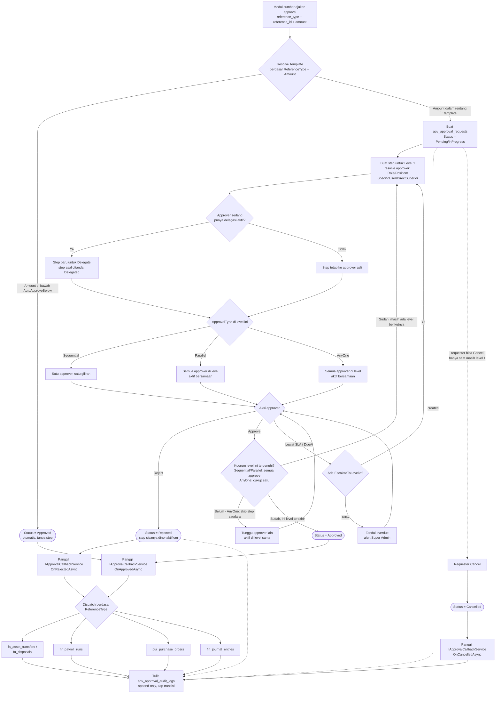

# General Approval Module (APV)

Mesin approval generik lintas modul — dirancang supaya modul lain (Fixed Assets, Purchasing, Payroll, Finance, dst.) tidak perlu bikin tabel & alur approval sendiri-sendiri, cukup daftarkan satu baris ke `apv_approval_requests` (pola `reference_type` + `reference_id`, sama seperti General Document). **Modul ini sudah diimplementasi dan fungsional end-to-end** (Domain → Infrastructure → Application → API → Web → Hangfire → SignalR/email), dengan **satu integrasi nyata sejauh ini: HR Leave Request** (lihat §5).

Rencana desain awal lengkap ada di `SINARA_ERP_GeneralApproval_Panduan_Detail.docx` (5 fase: APV-1 Fondasi, APV-2 Request & Workflow, APV-3 Notifikasi & Eskalasi, APV-4 Integrasi & Audit, APV-5 Laporan & Hak Akses) — dokumen ini merangkum isi docx tsb DAN membandingkannya dengan kenyataan di kode saat ini (lihat §8 untuk tabel rencana-vs-kenyataan).

## 1. Entitas Domain (`ERP.Domain/Entities/Approval`, `ERP.Domain/Enums/Approval`)

- **`ApvApprovalTemplate`** — satu baris = satu aturan approval untuk satu jenis dokumen: Code, Name, Module, `ReferenceType`, `ApprovalType` (Sequential/Parallel/AnyOne), MinAmount/MaxAmount (rentang nilai transaksi yang dicakup), AutoApproveBelow (approve otomatis tanpa lewat approver), SlaHours (default 24), AllowDelegation, RequireCommentOnReject, IsActive.
- **`ApvApprovalLevel`** — level dalam satu template, urut lewat LevelOrder (unik & berurutan per template): LevelName, `ApproverType` (Role/Position/SpecificUser/DirectSuperior) + FK sesuai tipe, MinApproversRequired (kuorum Parallel/AnyOne), EscalationHours + EscalateToLevelId (self-FK).
- **`ApvDelegation`** — DelegatorUserId → DelegateUserId, TemplateId (nullable = berlaku semua template), StartDate/EndDate, Reason, IsActive.
- **`ApvApprovalRequest`** — satu pengajuan: RequestNo (auto `APV-{YYYY}-{00001}`, reset tiap tahun), TemplateId, ReferenceType + ReferenceId, Subject, Amount, RequestedBy/At, CurrentLevelId, Status (Pending/InProgress/Approved/Rejected/Cancelled/Expired), FinalActionAt/By, Notes. **Unique constraint** `(reference_type, reference_id)` selama status Pending/InProgress — satu record sumber cuma boleh punya satu approval request yang berjalan.
- **`ApvApprovalStep`** — satu baris per approver per level per request: RequestId, LevelId, ApproverUserId, IsDelegated + DelegatedFromUserId, Action (Approved/Rejected/Delegated/Returned, nullable = belum bertindak), ActionAt, Comment (wajib kalau Rejected), DueAt (RequestedAt + SlaHours), NotifiedAt, ReminderCount, IsActive.
- **`ApvNotification`** — per step: RecipientUserId, NotificationType (NewRequest/Approved/Rejected/Reminder/Escalated/Cancelled/Delegated), Channel (InApp/Email/Both), Subject/Body, IsRead, SentAt/FailedAt/RetryCount.
- **`ApvApprovalAuditLog`** — log append-only (tidak bisa diubah/dihapus): RequestId, StepId, ActorUserId, Action (string bebas), OldStatus/NewStatus, IpAddress, UserAgent, Comment, CreatedAt.

**Enum** (`ERP.Domain/Enums/Approval`): `ApprovalType` (Sequential/Parallel/AnyOne), `ApprovalApproverType` (Role/Position/SpecificUser/DirectSuperior), `ApprovalRequestStatus` (Pending/InProgress/Approved/Rejected/Cancelled/Expired), `ApprovalStepAction` (Approved/Rejected/Delegated/Returned — `Returned` ada di enum tapi belum dipakai engine), `ApprovalNotificationChannel` (InApp/Email/Both), `ApprovalNotificationType`.

## 2. API Endpoints (`ERP.API/Controllers/v1/Approval`, semua `[Authorize]`)

| Controller | Endpoint utama |
|---|---|
| `ApprovalDashboardController` | KPI ringkasan approval |
| `ApprovalInboxController` | Daftar step aktif milik user login, dengan link ke detail record sumber |
| `ApprovalRequestsController` | Submit (dipanggil in-process oleh modul sumber, bukan endpoint publik langsung), approve/reject/cancel, get by id/reference |
| `ApprovalTemplatesController` (+ nested Levels) | CRUD template & level approval |
| `ApprovalDelegationsController` | CRUD delegasi + revoke + opsi approver |
| `ApprovalLookupsController` | Dropdown lookup (role/position/user untuk konfigurasi level) |
| `ApprovalReportsController` | Dashboard, SLA report, by-template report, audit log |

Route persis sesuai kontrak `ApprovalApiClient`/`IApprovalApiClient` yang sudah dibangun di Web layer sebelumnya — Web JALAN TANPA PERUBAHAN begitu API-nya tersedia.

## 3. Halaman Web (`ERP.Web/Controllers/Approval/ApprovalController*.cs`, Views di `Approval/`)

| Menu | Route |
|---|---|
| Approval Dashboard | `/approval` |
| Approval Inbox | `/approval/inbox` |
| My Approval Requests | `/approval/my-requests` |
| Delegations | `/approval/delegations` |
| Approval Templates | `/approval/templates` (+ Level per template di `/approval/templates/{id}/levels`, bukan menu sidebar sendiri) |
| SLA Report | `/approval/reports/sla` |
| By Template Report | `/approval/reports/by-template` |
| Audit Trail | `/approval/reports/audit` |

- **Approval Inbox** punya tombol "Detail" per baris yang langsung buka halaman detail record sumbernya — lewat `ApprovalReferenceLinkResolver` (`ERP.Web/Services/ApprovalReferenceLinkResolver.cs`), registry kecil `ReferenceType` → URL template. Baru ada satu entry (`hr_leave_requests` → `/hr/leave/requests/details/{id}`); belum dipasang di `/approval/my-requests`.
- Permission mengikuti mekanisme yang sama dengan modul lain: `CfgRoleMenuPermission` per (Role, Menu) + `[RequireMenuPermission]` di Web controller (bukan skema string `apv.*` seperti rencana awal docx). Super Admin otomatis dapat izin penuh lewat `SeedSuperAdminPermissionsAsync` (generik untuk semua menu, bukan seed khusus APV).

## 4. Business Rules / Logic Penting

**Routing engine** (`ApprovalRequestService`)
- Request baru → resolve template berdasarkan ReferenceType + Amount (dicocokkan MinAmount/MaxAmount) → kalau Amount di bawah AutoApproveBelow, langsung Status=Approved tanpa bikin step → kalau tidak, buat step level 1, aktifkan, kirim notifikasi.
- **Sequential**: level diproses satu-satu; level N selesai (kuorum terpenuhi) baru level N+1 aktif; level terakhir selesai → Approved → panggil callback.
- **Parallel**: semua step di level yang sama aktif bersamaan; level selesai kalau jumlah approve ≥ `MinApproversRequired`.
- **AnyOne**: sama seperti Parallel, tapi step saudara di level sama otomatis di-skip begitu satu approver approve.
  - **Catatan implementasi**: kuorum "selesai" memakai `MinApproversRequired` yang statis di config Level, bukan dihitung ulang dari jumlah approver riil yang ter-resolve saat request dibuat. Untuk ApproverType Role/Position, jumlah orang bisa berubah (staf baru masuk role) — kalau butuh "benar-benar semua anggota role saat itu", set `MinApproversRequired` manual sesuai estimasi headcount, atau pakai ApproverType=SpecificUser.
- Reject dari approver manapun di level manapun → langsung Status=Rejected, semua step aktif dinonaktifkan, callback dipanggil — tidak lanjut ke level berikutnya.
- Requester bisa Cancel HANYA selama status Pending/InProgress DAN belum ada satupun step yang Approved (bukan cuma "level 1" — approval pertama di level manapun mengunci status).

**SLA, Reminder, Eskalasi** (job Hangfire `approval-escalation-reminders`, tiap 30 menit, logic di `ProcessEscalationsAndRemindersAsync`)
- Tiap step punya DueAt = RequestedAt + SlaHours template.
- Sisa waktu ≤ 4 jam & belum pernah diingatkan → reminder pertama; sisa ≤ 1 jam & sudah 1x diingatkan → reminder kedua (mendesak).
- Lewat DueAt & level punya EscalateToLevelId → otomatis eskalasi ke level tsb; tidak ada target eskalasi → alert Super Admin + ditandai overdue di dashboard (tidak otomatis approve/reject).

**Delegasi**
- Terjadwal: User A set delegasi ke User B untuk periode tertentu, scope ke satu template atau semua. Saat engine resolve approver suatu step dan approver asli sedang punya delegasi aktif yang cocok, step baru dibuat untuk delegate (IsDelegated=true), step lama ditandai Delegated — otomatis tiap level diaktifkan, tidak perlu aksi manual.
- Ad-hoc per-aksi: saat approve/reject, `TakeApprovalActionRequest.DelegateUserId` bisa diisi untuk meneruskan step itu ke user lain tanpa perlu baris `apv_delegations` permanen.

**Callback ke modul sumber** (`IApprovalCallbackService`, pola registry)
- Approval tidak tahu cara memproses efek samping tiap jenis dokumen (pindah lokasi aset, posting jurnal, kirim PO ke vendor) — itu tanggung jawab modul sumber.
- Pola: `OnApprovedAsync/OnRejectedAsync/OnCancelledAsync(referenceId, actorUserId, ...)`, di-resolve dari `IEnumerable<IApprovalCallbackService>` (dicari lewat `ReferenceType`) yang di-inject ke `ApprovalRequestService`. Kalau tidak ada implementasi yang cocok, callback dilewati tanpa error — request tetap ganti status, cuma tidak ada efek samping ke modul sumber.
- `SubmitAsync` sengaja **tidak diekspos sebagai endpoint API publik** — hanya dipanggil modul sumber lewat Application layer secara in-process (persis seperti `LeaveService.SubmitAsync` memanggilnya).
- Setiap transisi status (dibuat/diapprove/ditolak/dieskalasi/dibatalkan/diingatkan) dicatat ke `apv_approval_audit_logs`, terlepas dari callback berhasil atau tidak.

**Template Default** (`DataSeeder.SeedApprovalTemplatesAsync`, idempotent lewat cek Code)

| Code | Module | ReferenceType | ApprovalType | SLA | Level | Catatan |
|---|---|---|---|---|---|---|
| FA_TRANSFER | Fixed Assets | `fa_asset_transfers` | Sequential | 24 jam | DirectSuperior → Role Finance Staff | — |
| FA_DISPOSAL | Fixed Assets | `fa_disposals` | Sequential | 48 jam | DirectSuperior → Role Finance Staff | — |
| FA_MAINTENANCE | Fixed Assets | `fa_maintenance_orders` | AnyOne | 24 jam | Role Inventory Manager | Auto-approve < Rp1.000.000 |
| PRL_PAYROLL | Payroll | `hr_payroll_runs` | Sequential | 24 jam | Role HR Manager → Role Finance Staff | ReferenceType dikoreksi dari rencana docx (`prl_payroll_runs`) ke nama tabel asli |
| PRC_PO_LOW | Purchasing | `pur_purchase_orders` | AnyOne | 8 jam | Role Finance Staff | Auto-approve < Rp500.000; berlaku ≤ Rp5.000.000 (asumsi seeder); **tabel sumber belum ada** |
| PRC_PO_HIGH | Purchasing | `pur_purchase_orders` | Sequential | 24 jam | DirectSuperior → Role Finance Staff | Berlaku > Rp5.000.000 (asumsi seeder); **tabel sumber belum ada** |
| FIN_JOURNAL | Finance | `fin_journal_entries` | Sequential | 24 jam | Role Finance Staff | — |
| HR_LEAVE | HR | `hr_leave_requests` | Sequential | 24 jam | DirectSuperior | RequireCommentOnReject=false; **satu-satunya template yang benar-benar dipanggil** modul sumbernya |

Role yang dipakai (`HR Manager`, `Finance Staff`, `Inventory Manager`) sudah ada di `DataSeeder.SeedRolesAsync`, bukan role baru; `SeedApprovalTemplatesAsync` skip seluruh seeding kalau role-role itu belum ter-seed (guard urutan).

## 5. Integrasi Modul HR Leave Request (satu-satunya integrasi nyata sejauh ini)

`hr/leave/requests` memakai General Approval sebagai mesin approval, menggantikan flip status langsung. Tombol Approve/Reject tidak berubah bentuk, tapi sekarang cuma muncul kalau user login benar-benar boleh bertindak.

- **Submit** — `LeaveService.SubmitAsync` memanggil `IApprovalRequestService.SubmitAsync("HR", "hr_leave_requests", entity.Id, subject, amount: null, requestedByUserId, notes)`. `requestedByUserId` dari `HrEmployee.UserId` — **kalau karyawan tidak punya akun user ter-link, pengajuan cuti GAGAL** ("Cannot submit for approval: '{nama}' has no linked user account.", baris yang sudah tersimpan di-rollback via soft-delete).
- **Approve/Reject** — endpoint API cek dulu `FindActiveRequestIdAsync`: kalau ada `ApprovalRequest` Pending/InProgress, aksi didelegasikan ke mesin APV (audit log, notifikasi, enforcement siapa yang boleh bertindak); kalau tidak ada (data lama), fallback ke `LeaveService.ApproveAsync`/`RejectAsync` lama (flip status langsung).
- **Efek samping** — `LeaveRequestApprovalCallbackService` (ReferenceType=`hr_leave_requests`) dipanggil saat keputusan final: set Status/ApprovedBy/ApprovedAt, dan kalau Approved, sync ke `HrAttendanceRecord` lewat `LeaveAttendanceSyncHelper` (dipakai bersama alur baru & fallback lama). Cancel dari APV diperlakukan sama seperti Reject.
- **Siapa yang bisa approve** — template `HR_LEAVE` cuma 1 level (`DirectSuperior`), jadi HANYA manajer departemen karyawan bersangkutan (`HrDepartment.ManagerId`) yang punya step aktif — lebih ketat dari sebelumnya (dulu siapapun dengan izin menu bisa approve siapapun). Departemen tanpa `ManagerId` bikin submit gagal ("Cannot resolve direct superior...").
- **`RequireCommentOnReject=false`** khusus HR_LEAVE (beda dari default `true`) — supaya reject-tanpa-alasan yang sudah ada sebelumnya tetap sama perilakunya.
- **`LeaveRequestDto.CanApprove`** dihitung server-side lewat `GetActionablePermissionsAsync` — dipakai untuk sembunyikan tombol Approve/Reject SEBELUM klik, bukan menunggu gagal 403 setelahnya.
- **Backfill**: leave request Pending yang dibuat sebelum integrasi ini di-backfill otomatis saat startup API (`DataSeeder.BackfillLeaveRequestApprovalsAsync`) — employee tanpa akun user dilewati (warning, tidak menghentikan startup).
- **Bug fix terkait lampiran dokumen** (bukan di APV, tapi ditemukan lewat integrasi ini): `DocumentService.EnsureLeaveRequestAccessAsync` sekarang juga cek langsung ke `apv_approval_steps`/`apv_approval_requests` — siapapun yang punya step aktif (`IsActive && Action == null`) untuk request yang ter-link, diizinkan akses lampiran leave request itu (mis. lihat surat dokter sebelum approve/reject dari mobile). Detail lengkap di `ReadMeDocumentGeneral.md`.

## 6. Relasi Kunci

- `ApvApprovalRequest` → `ApvApprovalTemplate`, → record sumber (via `ReferenceType`+`ReferenceId`, bukan FK — pola generik lintas modul).
- `ApvApprovalStep` → `ApvApprovalRequest`, → `ApvApprovalLevel`, → `SysUser` (approver, opsional delegate).
- `ApvApprovalTemplate` → `ApvApprovalLevel` (1:many, urut LevelOrder); Level → Role/Position/SpecificUser (sesuai ApproverType) atau `HrDepartment.ManagerId` (DirectSuperior).
- `ApvDelegation` → `SysUser` (Delegator+Delegate), opsional → `ApvApprovalTemplate`.
- `HrLeaveRequest` ↔ `ApvApprovalRequest` (via ReferenceType=`hr_leave_requests`) — satu-satunya hubungan cross-module yang sudah benar-benar aktif.

## 7. Diagram Alur

## 8. Jangan Tertukar dengan Modul Lain

Ada DUA entitas approval-matrix yang **tidak ada hubungannya** dengan General Approval — jangan disangka bagian dari APV:

- **`PurApprovalConfig`** (Purchasing) — matriks approval per level (DocumentType, Level, MinAmount/MaxAmount, ApproverEmployeeId), CRUD sendiri (`/purchasing/approval-configs`), langsung ke `AppDbContext` tanpa service layer. **Tidak dipakai transaksi apapun** — entity PurchaseRequisition/PurchaseOrder yang seharusnya memicu approval ini belum ada.
- **`SalApprovalConfig`** (Sales) — pola sama persis (`/sales/approval-configs`), juga belum ada transaksi Quotation/Sales Order yang memicunya.
- Enum `Purchasing.ApprovalStatus` dan `Sales.SalesApprovalStatus` ada di kode tapi tidak dipakai di manapun (dead code) — sisa desain awal sebelum diputuskan pakai General Approval terpusat.

## 9. Known Gaps / Belum Lengkap

- **Integrasi ke modul lain belum ada** — Fixed Assets, Purchasing, Payroll, Finance MASIH belum memanggil `IApprovalRequestService.SubmitAsync` atau mengimplementasikan `IApprovalCallbackService`. Engine-nya sudah lengkap dan bisa dipanggil langsung secara in-process, tapi belum ada "tombol Submit for Approval" di modul-modul itu — sebagian juga karena entity transaksional sumbernya sendiri (PR/PO, dst.) belum lengkap dibangun (lihat `ReadMePurchasing.md`, `ReadMeSales.md`).
  - Urutan kerja untuk menyambungkan modul baru: (1) pastikan entity transaksionalnya punya status "PendingApproval" + field hasil approval, (2) panggil `SubmitAsync(...)` saat user klik "Submit for Approval", (3) buat kelas yang implement `IApprovalCallbackService` dengan `ReferenceType` yang cocok, daftarkan di `ERP.Application/DependencyInjection.cs` sebagai `AddScoped<IApprovalCallbackService, XxxCallbackService>()` (bisa lebih dari satu, routing resolve otomatis lewat `ReferenceType`).
- **SignalR client di Razor view belum dipasang** — hub `/hubs/approval` sudah jalan di server dan push ke grup `approval-user-{userId}`, tapi belum ada JS client (`@microsoft/signalr`) di `ERP.Web` yang connect & tampilkan toast real-time. Notifikasi tetap tersimpan di `apv_notifications`, bisa dibaca lewat polling/reload halaman.
- **`ReferenceType` beberapa template default menunjuk tabel yang belum ada** (`pur_purchase_orders` untuk PRC_PO_LOW/PRC_PO_HIGH) — baris template tetap di-seed sebagai config siap-pakai, begitu modul Purchasing punya entity PO tinggal panggil `SubmitAsync`.
- **Nilai split PRC_PO_LOW/PRC_PO_HIGH (Rp5.000.000)** adalah asumsi penulis seeder, bukan dari docx (docx cuma sebut ambang auto-approve Rp500.000 untuk PO rendah) — sesuaikan lewat halaman Templates kalau tidak cocok kebutuhan nyata.
- **`ApprovalStepAction.Returned`** ada di enum tapi tidak dipakai engine — tidak ada alur "kembalikan ke requester untuk revisi".
- **[DIKONFIRMASI 2026-07-28, BUKAN LAGI HIPOTETIS] Kredensial SMTP di `ERP.API/appsettings.json` adalah kredensial Gmail ASLI dan SUDAH BOCOR ke repo publik** (`github.com/development200391/SINARA`, dikonfirmasi `"private": false`, `git status -sb` sinkron dengan `origin/master`, kredensial ter-commit sejak `2b015dc`). Ini eksposur secret aktif sekarang, bukan risiko "kalau nanti di-push". Rekomendasi segera:
  1. Rotate App Password Gmail sekarang juga (invalidate yang lama).
  2. Rotate juga secret lain di file yang sama (connection string Postgres/Redis, JWT signing key) karena semuanya ter-expose bersamaan.
  3. Pindahkan semua secret ke user-secrets/environment variable, tambahkan `appsettings.json` (atau minimal section Smtp/ConnectionStrings/Jwt) ke `.gitignore`.
  4. Riwayat git yang sudah ter-push tetap menyimpan secret lama walau file diubah — rotasi kredensial wajib, bukan cukup hapus dari commit berikutnya.
- Wiring Hangfire di `Program.cs` berubah bentuk sejak commit `952c81e` ("adjust code to deploy VPS") — sekarang dibungkus `app.Services.CreateScope()` + `IRecurringJobManager` (sebelumnya `RecurringJob.AddOrUpdate` statis langsung). Nama job/cron/behavior sama persis, cuma jadi DI-scoped — bukan perubahan fungsional.

## 10. Tabel Rencana vs Kenyataan (ringkasan status implementasi)

| Layer | Direncanakan (docx) | Kenyataan di Kode |
|---|---|---|
| Domain entities (7 tabel) | Lengkap | **Lengkap** |
| Enum | 6 enum | Ada semua, sudah final |
| Migration / tabel Postgres | 7 tabel `apv_*` | **Lengkap**, sudah diterapkan (`20260713100000_AddGeneralApproval`) |
| Application services | Template/Request/RoutingEngine/Notification/Delegation/Report | **Lengkap** — 4 service menggantikan 8 interface rencana docx (beberapa digabung) |
| API controllers | Full REST, 8 controller | **Lengkap**, 7 controller (route sesuai kontrak `ApprovalApiClient` persis) |
| Web layer | Dashboard/Inbox/My Requests/Delegations/Templates/Levels/Reports | Lengkap dibangun sebelumnya, sekarang **benar-benar jalan** |
| Hangfire (job terjadwal) | Eskalasi/reminder tiap 30 menit | **Lengkap** |
| MailKit (email) | Kirim email approval | **Lengkap**, pakai config `Smtp` yang sudah ada |
| SignalR (push real-time) | Notifikasi real-time | **Server lengkap**; client JS di Razor belum dipasang |
| DataSeeder | Module + menu + permission + seed template/level | **Lengkap** — permission ikut `CfgRoleMenuPermission` yang sudah ada, 7 template + level default ter-seed |
| Integrasi ke modul lain | Callback pattern per reference_type | **HR Leave Request** sudah terintegrasi penuh — satu-satunya sejauh ini. Fixed Assets/Payroll/Purchasing/Finance belum |

## Acuan Implementasi

- Desain awal: `SINARA_ERP_GeneralApproval_Panduan_Detail.docx` (root repo)
- Domain: `ERP.Domain/Entities/Approval/*.cs` (7 file), `ERP.Domain/Enums/Approval/*.cs` (6 file)
- DTO: `ERP.Application/DTOs/Approval/ApprovalDtos.cs`
- Migration: `ERP.Infrastructure/Migrations/20260713100000_AddGeneralApproval.cs`
- Application services: `ERP.Application/Services/Approval/*.cs`
- API: `ERP.API/Controllers/v1/Approval/*.cs`, `ERP.API/Services/ApprovalNotificationService.cs`, `ERP.API/Hubs/ApprovalHub.cs`, wiring Hangfire/SignalR di `ERP.API/Program.cs`
- Web: `ERP.Web/Controllers/Approval/ApprovalController*.cs`, `ERP.Web/ViewModels/Approval/ApprovalViewModels.cs`, `ERP.Web/Views/Approval/**`, `ERP.Web/Services/ApprovalApiClient.cs`
- Seed: `ERP.Infrastructure/Data/DataSeeder.cs` (module/menu/template/level/backfill)
- Integrasi HR Leave Request: `ERP.Application/Services/HR/LeaveService.cs`, `LeaveRequestApprovalCallbackService.cs`, `LeaveAttendanceSyncHelper.cs`, `ERP.API/Controllers/v1/HR/LeaveRequestsController.cs`, `ERP.Web/Services/ApprovalReferenceLinkResolver.cs`
- Entitas approval-matrix TIDAK TERKAIT: `ERP.Domain/Entities/Purchasing/PurApprovalConfig.cs`, `ERP.Domain/Entities/Sales/SalApprovalConfig.cs`
